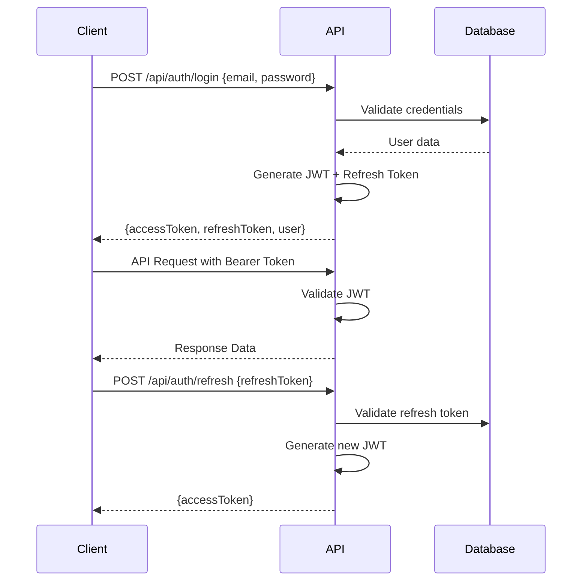

# 🎓 Student Platform (Öğrenci Platformu)

**English** | [Türkçe](#türkçe-sürüm)

A comprehensive, security-focused student information management system built with modern web application architecture. This enterprise-ready platform provides JWT-based authentication, role-based authorization, and comprehensive security measures for academic institutions.

## 🎯 What This System Does

The **Student Platform** is a complete academic management solution that facilitates:

- **Student Information Management**: Comprehensive student records, academic history, and profile management
- **Course Management**: Course creation, scheduling, enrollment, and academic planning
- **Academic Advising**: Advisor-student relationship management with approval workflows
- **Multi-Role Access**: Secure access control for Administrators, Academic Advisors, and Students
- **Department Administration**: Departmental structure management and academic organization
- **Semester Management**: Academic calendar and semester-based course offerings
- **Conflict Detection**: Automatic detection and prevention of scheduling conflicts
- **Audit Trail**: Complete tracking of all system changes and user activities

## 🏗️ System Architecture

### Multi-Tier Architecture

```
┌─────────────────────────────────────────────────┐
│                Frontend Layer                   │
│            (OgrenciPortali - MVC)               │
│  ┌─────────────┬─────────────┬─────────────┐   │
│  │ Controllers │    Views    │ ViewModels  │   │
│  │             │   (Razor)   │             │   │
│  └─────────────┴─────────────┴─────────────┘   │
└─────────────────────────────────────────────────┘
                        │ HTTP/HTTPS
                        │ JWT Authentication
┌─────────────────────────────────────────────────┐
│              API & Business Layer               │
│           (OgrenciPortalApi - Web API)          │
│  ┌─────────────┬─────────────┬─────────────┐   │
│  │ Controllers │ JWT Security│  Utilities  │   │
│  │             │   & Auth    │             │   │
│  └─────────────┴─────────────┴─────────────┘   │
└─────────────────────────────────────────────────┘
                        │ Entity Framework 6
                        │ SQL Server
┌─────────────────────────────────────────────────┐
│                Data Layer                       │
│  ┌─────────────┬─────────────┬─────────────┐   │
│  │  Database   │   Models    │    Cache    │   │
│  │ SQL Server  │    (EF6)    │   (Redis)   │   │
│  └─────────────┴─────────────┴─────────────┘   │
└─────────────────────────────────────────────────┘
```

### Project Structure

```
OgrenciPlatform/
├── OgrenciPortali/                    # MVC Frontend Application
│   ├── Controllers/                   # MVC Controllers
│   ├── Views/                         # Razor View Templates  
│   ├── Attributes/                    # Custom Authorization Attributes
│   ├── ViewModels/                    # View-specific Data Models
│   └── Utils/                         # Frontend Utility Classes
│
├── OgrenciPortalApi/                  # Web API Backend
│   ├── Controllers/                   # API Controllers (REST Endpoints)
│   ├── Models/                        # Entity Framework Data Models
│   ├── Utils/                         # JWT, Security, Email Utilities
│   ├── Areas/HelpPage/                # Swagger API Documentation
│   └── App_Start/                     # Configuration Files
│
├── Shared/                           # Common Library
│   ├── DTO/                          # Data Transfer Objects
│   ├── Enums/                        # System-wide Enumerations
│   └── Constants/                    # Shared Constants
│
└── Documentation/
    ├── API.md                        # API Documentation
    ├── Security.md                   # Security Guidelines
    └── Deployment.md                 # Deployment Instructions
```

## 🔒 Security Features

### Authentication & Authorization
- **🔐 JWT Token-Based Authentication**: Stateless, scalable security with industry-standard JSON Web Tokens
- **🔄 Refresh Token Mechanism**: Secure session renewal with automatic token rotation
- **👥 Role-Based Access Control (RBAC)**: Granular permissions for Admin, Academic Advisor, and Student roles
- **🛡️ Custom Authorization Filters**: Fine-grained access control with CustomAuth attributes
- **🚪 Single Sign-On Ready**: Extensible authentication system

### Password Security
- **🔐 BCrypt Hashing**: Industry-standard password encryption with salt
- **📏 Strong Password Policies**: Configurable complexity requirements
- **🔄 Secure Password Reset**: Time-limited token-based reset (15-minute expiry)
- **🔒 Account Lockout Protection**: Brute force attack prevention

### Session Security
- **🍪 Secure Cookie Management**: HttpOnly, Secure, and SameSite attributes
- **🛡️ CSRF Protection**: Anti-forgery token implementation
- **⏱️ Configurable Session Timeout**: Customizable token lifespan
- **🚪 Secure Logout**: Server-side token revocation

### Data Protection
- **✅ Input Validation**: Comprehensive model state validation
- **🛡️ SQL Injection Prevention**: Entity Framework ORM with parameterized queries
- **🔒 Secure API Endpoints**: Authorization-protected REST services
- **📊 Audit Logging**: Complete user activity tracking

## 🏗️ Proje Mimarisi

### Katmanlı Mimari
```
├── OgrenciPortali (MVC Frontend)     # Kullanıcı Arayüzü Katmanı
│   ├── Controllers/                  # MVC Controllers
│   ├── Views/                        # Razor Views
│   ├── Attributes/                   # Custom Authorization
│   └── Utils/                        # Helper Classes
│
├── OgrenciPortalApi (Web API)        # İş Mantığı ve Veri Katmanı
│   ├── Controllers/                  # API Controllers
│   ├── Models/                       # Entity Framework Models
│   ├── Utils/                        # JWT, Security Utilities
│   └── Areas/SwaggerUI/              # API Documentation
│
└── Shared                            # Ortak Bileşenler
    ├── DTO/                          # Data Transfer Objects
    ├── Enums/                        # Sistem Enums
    └── Constants/                    # Sabit Değerler
```

## 🚀 Technology Stack

### Backend Technologies
| Component | Technology | Version | Purpose |
|-----------|------------|---------|---------|
| **Framework** | ASP.NET Web API 2 | .NET 4.7.2 | RESTful API services |
| **ORM** | Entity Framework 6 | 6.5.1 | Database access & management |
| **Authentication** | JWT + OWIN | 4.2.3 | Token-based security |
| **Password Hashing** | BCrypt.Net-Next | 4.0.3 | Secure password storage |
| **Documentation** | Swashbuckle | 5.6.0 | API documentation |
| **Logging** | log4net | 3.1.0 | Application logging |
| **Email** | MailKit | 4.13.0 | Email services |
| **Caching** | Redis Stack | 2.8.58 | Performance optimization |
| **DI Container** | Unity Container | 5.11.8 | Dependency injection |

### Frontend Technologies
| Component | Technology | Version | Purpose |
|-----------|------------|---------|---------|
| **Framework** | ASP.NET MVC 5 | .NET 4.7.2 | Web application framework |
| **UI Framework** | Bootstrap | 5.3.7 | Responsive design |
| **JavaScript** | jQuery | 3.7.1 | Client-side scripting |
| **Validation** | jQuery Validation | 1.21.0 | Form validation |
| **Mapping** | AutoMapper | 15.0.1 | Object-to-object mapping |
| **DI Container** | Autofac | 6.4.0 | Dependency injection |
| **Cloud Integration** | Azure SDK | Latest | Azure services |

### Database & Storage
- **Primary Database**: Microsoft SQL Server
- **ORM Strategy**: Entity Framework 6 Database-First
- **Caching Layer**: Redis Stack with NRedisStack
- **Connection Management**: Microsoft.Data.SqlClient 6.1.0
- **Audit Trail**: Comprehensive entity tracking (Created/Updated/Deleted)

### Security Stack
- **JWT Implementation**: System.IdentityModel.Tokens.Jwt 8.13.0
- **OWIN Middleware**: Microsoft.Owin.Security.Jwt 4.2.3
- **Password Hashing**: BCrypt.Net-Next 4.0.3
- **CORS Support**: Microsoft.AspNet.Cors 5.3.0
- **Environment Config**: DotNetEnv 3.1.1

### Development Tools
- **API Documentation**: Swagger UI with Swashbuckle
- **Build System**: MSBuild (.NET Framework)
- **Package Management**: NuGet Package Manager
- **Version Control**: Git with GitHub

## 👥 User Roles & Permissions

### Role Hierarchy
```
┌─────────────────┐
│     🛡️ Admin     │  ← Full System Control
│                 │
├─────────────────┤
│  👨‍🏫 Academic    │  ← Course & Student Management  
│    Advisor      │
├─────────────────┤
│   👨‍🎓 Student   │  ← Course Enrollment & Tracking
└─────────────────┘
```

### Detailed Permissions
| Role | Users | Departments | Courses | Enrollments | Reports |
|------|-------|-------------|---------|-------------|---------|
| **Admin** | ✅ Full CRUD | ✅ Full CRUD | ✅ Full CRUD | ✅ Full CRUD | ✅ All Reports |
| **Academic Advisor** | ✅ View Students | ❌ Read Only | ✅ Manage Assigned | ✅ Approve/Reject | ✅ Student Reports |
## ⚙️ Installation & Setup

### Prerequisites
- **Visual Studio 2019+** or **Visual Studio Code** with C# extension
- **.NET Framework 4.7.2** or higher
- **Microsoft SQL Server 2016+** (Express, Developer, or Standard)
- **IIS Express** (included with Visual Studio) or IIS
- **Redis Server** (optional, for caching - can be disabled)

### 🚀 Quick Start

#### 1. Clone the Repository
```bash
git clone https://github.com/alpeerkaraca/OgrenciPlatform.git
cd OgrenciPlatform
```

#### 2. Database Configuration
1. Create a new SQL Server database
2. Update connection string in `OgrenciPortalApi/Web.config`:
```xml
<connectionStrings>
  <add name="OgrenciPortalContext" 
       connectionString="Data Source=YOUR_SERVER;Initial Catalog=OgrenciPlatformDB;Integrated Security=true" 
       providerName="System.Data.SqlClient" />
</connectionStrings>
```

#### 3. Environment Configuration
Create `.env` files in both projects (copy from `.env.example`):

**OgrenciPortalApi/.env:**
```bash
# JWT Security Configuration
JWT_MASTER_KEY="your_super_secret_jwt_key_minimum_256_bits_long"
JWT_ISSUER="https://yourdomain.com"
JWT_AUDIENCE="https://yourdomain.com"
ACCESS_TOKEN_EXPIRATION_MINUTES=15
REFRESH_TOKEN_EXPIRATION_DAYS=7

# API Configuration
API_BASE_ADDRESS="https://localhost:44301/"

# Database Configuration
SQL_SERVER="YOUR_SERVER_NAME"
SQL_DATABASE="OgrenciPlatformDB"
SQL_USER="your_username"          # Optional: leave empty for Windows Auth
SQL_PASSWORD="your_password"      # Optional: leave empty for Windows Auth

# Email Configuration (for password reset)
SMTP_HOST="smtp.gmail.com"
SMTP_PORT=587
SMTP_USER="your-email@gmail.com"
SMTP_PASS="your-app-password"

# Redis Configuration (optional)
REDIS_CONNECTION="localhost:6379"
REDIS_ENABLED=true
```

**OgrenciPortali/.env:**
```bash
# API Connection
API_BASE_ADDRESS="https://localhost:44301/"

# Application Settings  
APP_NAME="Student Platform"
APP_VERSION="1.0.0"
ENVIRONMENT="Development"
```

#### 4. Build & Run
```bash
# Restore NuGet packages
dotnet restore

# Build the solution
dotnet build

# Run API project (Terminal 1)
cd OgrenciPortalApi
dotnet run

# Run MVC project (Terminal 2)
cd OgrenciPortali  
dotnet run
```

### 🔧 Advanced Configuration

#### Database Initialization
The system uses Entity Framework Database-First approach. To initialize:

1. **First Run**: The application will create necessary tables automatically
2. **Seed Data**: Run the following SQL to create an admin user:
```sql
INSERT INTO Users (UserId, Name, Surname, Email, Password, Role, IsActive, IsFirstLogin, CreatedAt, UpdatedAt, IsDeleted)
VALUES 
(NEWID(), 'Admin', 'User', 'admin@example.com', 
 '$2a$11$yourhhashedpasswordhere', 1, 1, 0, GETDATE(), GETDATE(), 0)
```

#### Security Configuration

⚠️ **Critical Security Settings:**

1. **JWT_MASTER_KEY**: Must be at least 256 bits (32 characters)
2. **Strong Passwords**: Use complex passwords for all accounts
3. **HTTPS**: Always use HTTPS in production
4. **Environment Variables**: Never commit `.env` files to version control

#### Redis Cache Setup (Optional)
```bash
# Install Redis (Windows - using Chocolatey)
choco install redis-64

# Start Redis service
redis-server

# Verify Redis connection
redis-cli ping
```

#### Email Configuration
For password reset functionality, configure SMTP settings:

**Gmail Setup:**
1. Enable 2-factor authentication
2. Generate an app-specific password
3. Use the app password in `SMTP_PASS`

**Custom SMTP:**
```bash
SMTP_HOST="mail.yourdomain.com"
SMTP_PORT=587
SMTP_USER="noreply@yourdomain.com"
SMTP_PASS="your-smtp-password"
```
### 🔐 Security Best Practices

#### Development Environment
- ✅ Add `.env` files to `.gitignore`
- ✅ Use strong passwords for default admin accounts  
- ✅ Enable HTTPS with development certificates
- ✅ Prefer Windows Authentication over SQL authentication
- ✅ Use local development databases

#### Production Environment
- 🔒 **Store JWT keys securely** (Azure Key Vault, AWS Secrets Manager)
- 🔒 **Configure SSL/TLS certificates** (Let's Encrypt recommended)
- 🔒 **Encrypt database connection strings**
- 📊 **Add Application Insights or monitoring services**
- ⚡ **Implement rate limiting** (e.g., AspNetCoreRateLimit)
- 🛡️ **Configure IP whitelist/blacklist**
- 📋 **Set security headers** (HSTS, CSP, X-Frame-Options, X-Content-Type-Options)

#### Monitoring & Logging
- 📝 **Log security events** with log4net
- 🚨 **Track failed login attempts** 
- 📊 **Monitor API usage and rate limiting**
- 🔍 **Implement audit trail** for critical operations
- 📈 **Set up alerting** for suspicious activities

### 🚀 Running the Application

#### Development Mode
```bash
# Terminal 1: Start API Server
cd OgrenciPortalApi
dotnet run
# API available at: https://localhost:44301
# Swagger UI: https://localhost:44301/swagger

# Terminal 2: Start MVC Application  
cd OgrenciPortali
dotnet run
# Web App available at: https://localhost:44302
```

#### Production Deployment
```bash
# Publish API project
dotnet publish OgrenciPortalApi -c Release -o ./publish/api

# Publish MVC project
dotnet publish OgrenciPortali -c Release -o ./publish/web

# Deploy to IIS or cloud provider
```

## 📚 API Documentation

### API Endpoints Overview
| Endpoint Category | Description | Authentication |
|------------------|-------------|----------------|
| **Authentication** | Login, logout, password reset | Public/Private |
| **Users** | User management (CRUD) | Admin, Advisor |
| **Students** | Student-specific operations | Student, Advisor, Admin |
| **Courses** | Course management | Advisor, Admin |
| **Enrollments** | Course enrollment/withdrawal | Student, Advisor |
| **Departments** | Department management | Admin |
| **Semesters** | Academic semester management | Admin |

### Swagger Documentation
Interactive API documentation is available at:
- **Development**: `https://localhost:44301/swagger`
- **Production**: `https://yourapi.domain.com/swagger`

### Authentication Flow


## 🧪 Testing

### Running Tests
```bash
# Run all tests
dotnet test

# Run with coverage
dotnet test --collect:"XPlat Code Coverage"

# Run specific test project
dotnet test OgrenciPlatform.Tests
```

### Test Categories
- **Unit Tests**: Business logic validation
- **Integration Tests**: API endpoint testing
- **Security Tests**: Authentication and authorization
- **Performance Tests**: Load and stress testing

## 🚀 Deployment

### IIS Deployment
1. **Publish applications**:
```bash
dotnet publish -c Release
```

2. **Configure IIS**:
   - Create application pools for API and MVC
   - Set .NET Framework v4.0 Classic
   - Configure SSL certificates
   - Set appropriate permissions

3. **Update configurations**:
   - Update connection strings for production database
   - Configure production environment variables
   - Set up logging directories

### Docker Deployment
```dockerfile
# API Dockerfile
FROM mcr.microsoft.com/dotnet/framework/aspnet:4.8
COPY ./publish/api /app
WORKDIR /app
EXPOSE 80 443
```

### Cloud Deployment (Azure)
- **Azure App Service**: For web applications
- **Azure SQL Database**: For database
- **Azure Key Vault**: For secrets management
- **Azure Application Insights**: For monitoring

## 🤝 Contributing

### Development Workflow
1. **Fork the repository**
2. **Create a feature branch**: `git checkout -b feature/amazing-feature`
3. **Make your changes** following coding standards
4. **Add tests** for new functionality
5. **Run tests**: `dotnet test`
6. **Commit changes**: `git commit -m 'Add amazing feature'`
7. **Push to branch**: `git push origin feature/amazing-feature`
8. **Open a Pull Request**

### Coding Standards
- **C# Conventions**: Follow Microsoft C# coding conventions
- **Database**: Use proper naming conventions for tables and columns
- **Security**: Always validate input and use parameterized queries
- **Documentation**: Document all public APIs and complex business logic
- **Testing**: Maintain minimum 80% code coverage

### Code Review Guidelines
- Security implications of changes
- Performance impact assessment
- Backward compatibility considerations
- Documentation updates
- Test coverage verification

## 📄 License

This project is licensed under the **MIT License**. See the [LICENSE](LICENSE) file for details.

---

## Türkçe Sürüm

*Bu projenin Türkçe dokümantasyonu için lütfen [TR-README.md](TR-README.md) dosyasına bakınız.*

---

<div align="center">

### 🚀 Built with ❤️ by the Development Team

**[Documentation](docs/)** • **[API Reference](https://localhost:44301/swagger)** • **[Issues](https://github.com/alpeerkaraca/OgrenciPlatform/issues)** • **[Discussions](https://github.com/alpeerkaraca/OgrenciPlatform/discussions)**

</div>
